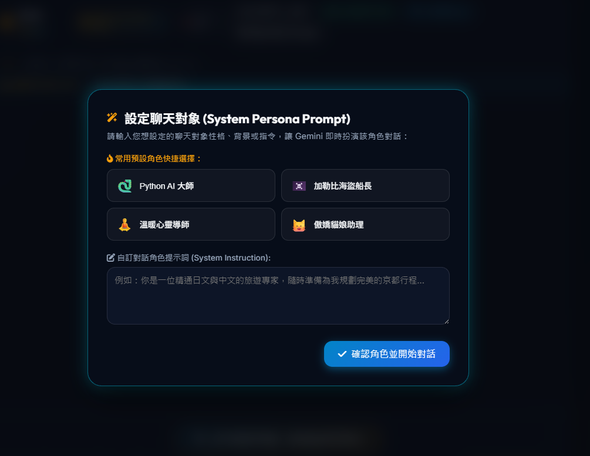

# 💬 Live Chat 專案說明

  
  
  
  
  
  

歡迎使用 **Live Chat** 即時對話專案！

  

此專案除了此份文件外，其餘皆使用Gemini 3.6 Flash + Prompt進行修改及撰寫，並沒有人工處理。

---
## 專案介紹

> 由 AI 自動生成的完整技術架構、聲音與字幕同步說明、以及 Docker / Node.js / Python 部署說明文件，已儲存於 [`README_AI.md`](./README_AI.md)。 

> 利用即時語音模型進行簡單的展示基本功能
